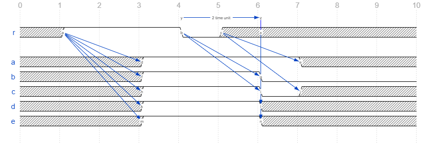

# Assignment

SV 有三种形式的 assignment：

- continuous assignment
- procedural assignment
- procedural continuous assignment

## Continuous Assignment

通过关键字 `assign` 进行的赋值操作。

```systemverilog
assign [ drive_strength ] [ delay ] a = b ;
```

- net 和 variable 都可以使用 continuous assignment 赋值
- continuous assignment 的 delay 模拟的是惯性时延（inertial-delay，存在分布式电容，驱动有惯性，**可以过滤掉毛刺**），假如驱动源在 delay 期间再次发生变化（即，当前已规划的驱动值还未来得及传输到目的端，驱动源的值再次发生变化），则：
  - 计算右边表达式的新值
  - 如果新值和当前已经规划的驱动值不同，取消原有规划的驱动 event
  - 如果新值和当前左边目标值相同，不规划任何 event
  - 如果新值和当前左边目标值不同，以当前时刻的状态重新计算 delay 值，并规划新的 event
- 如果 net 声明中包含 delay，但是不包含等号赋值，表示所有对该 net 的驱动都需要经过相应的 delay 后才能生效。例如 `wire #3 a;`
  表示所有对 a 的驱动需要三个时间单位 delay 后生效。
- 如果 net 声明中同时包含 delay 和等号赋值，则该 delay 仅应用于 implicit continuous assignment 单个驱动源，在其他对该 net 的 continuous assignment 中不生效。
- continuous assignment 不支持 intra-assignment delay

```systemverilog
module test;
  wire a;
  reg  b;
  initial begin
    $monitor("a=%0d, b=%0d, @%0t", a, b, $time);
    #10 $finish();
  end
  initial begin
    #1 b = 1'b1; // @1
    #3 b = 1'bx; // @4, will be ignored
    #1 b = 1'b1; // @5
    #1 b = 1'b0; // @6,  will be ignored
    #1 b = 1'bx; // @7
  end
  assign #2 a = b;
endmodule
```

```text title="output"
a=x, b=x, @0
a=x, b=1, @1
a=1, b=1, @3
a=1, b=x, @4
a=1, b=1, @5
a=1, b=0, @6
a=1, b=x, @7
a=x, b=x, @9
```

b 在 @4 和 @6 时刻的变化还未来得及传输到 a，分别在 @5 和 @7 被新的变化取代。

## Procedural Assignment

在 `always` 和 `initial` 块中进行的赋值操作。只有 variable 可以使用 procedural assignment，分为 blocking assignment 和 non-blocking assignment 两大类。non-blocking assignment 不阻塞当前进程，等号两边表达式在当前 time slot 的 active（或 re-active）event region 执行，赋值操作在 NBA（或 re-NBA）event region 执行。

### intra-assignment delay

在 Procedural Assignment 的等号右边添加 delay：

```systemverilog
a  = #dly b;
a <= #dly b;
```

- 对于 blocking assignment，阻塞当前进程。等号右边表达式在当前时刻执行，等号左边表达式以及赋值操作在 dly 唤醒后执行。
- 对于 non-blocking assignment，不阻塞当前进程。等号两边表达式在当前时刻执行，但是将赋值操作规划到 dly 之后。

*Example 1*:

```systemverilog
module test;
  int idx;
  int data[4];
  initial
  begin
    idx = 0;
    fork
      #1 idx = 1;
      data[idx]  = #2 1; // assign to data[1]
      data[idx] <= #2 2; // assign to data[0]
    join
    #1 $finish;
  end
  initial $monitor("data[0]=%0d,data[1]=%0d,data[2]=%0d,data[3]=%0d,@%0t",
    data[0],data[1],data[2],data[3],$time);
endmodule
```

```text title="output"
data[0]=0,data[1]=0,data[2]=0,data[3]=0,@0
data[0]=2,data[1]=1,data[2]=0,data[3]=0,@2
```

*Example 2*:

```systemverilog
module nonblock1;
  logic a, b, c, d, e, f;
  // blocking assignments
  initial begin
    a = #10 1; // a will be assigned 1 at time 10
    b = #2 0; // b will be assigned 0 at time 12
    c = #4 1; // c will be assigned 1 at time 16
  end
  // nonblocking assignments
  initial begin
    d <= #10 1; // d will be assigned 1 at time 10
    e <= #2 0; // e will be assigned 0 at time 2
    f <= #4 1; // f will be assigned 1 at time 4
  end
endmodule
```

*Example 3*:

```systemverilog
module multiple2;
  logic a;
  initial a = 1;
  initial a <= #4 0; // schedules 0 at time 4
  initial a <= #4 1; // schedules 1 at time 4
  // At time 4, a = ??
  // The assigned value of the variable is indeterminate
endmodule
```

*Example 4*:

```systemverilog
module multiple3;
  logic a;
  initial #8 a <= #8 1; // executed at time 8;
  // schedules an update of 1 at time 16
  initial #12 a <= #4 0; // executed at time 12;
  // schedules an update of 0 at time 16
  // Because it is determinate that the update of a to the value 1
  // is scheduled before the update of a to the value 0,
  // then it is determinate that a will have the value 0
  // at the end of time slot 16.
endmodule
```

## Procedural Continuous Assignment

## Assign vs. Always

```systemverilog
module test;
  logic r, a, b, c, d, e;

  initial begin
    #1 r = 1'b1; // @1
    #3 r = 1'b0; // @4
    #1 r = 1'bx; // @5
  end
  initial #10 $finish;

  assign #2 a = r;
  always @(r) b  = #2 r;
  always @(r) c <= #2 r;
  always @(r) #2 d  = r;
  always @(r) #2 e <= r;
endmodule
```



r 在 @1 和 @4 的变化之间隔了 3 个时间单位，满足 #2 的时延要求，a/b/c/d/e 均在 @3 由 x 变为 1。r 在 @4 和 @5 的变化之间只有一个时间单位，不满足 #2 的时延要求，a/b/c/d/e 表现不尽相同：

- 对于 a，assign delay 是惯性时延，r@4 的变化被忽略
- 对于 b，intra-assignment delay 使用 delay 前的值，r@5 的变化没有触发新的 event，因为此时线程被阻塞中
- 对于 c，intra-assignment delay 使用 delay 前的值，并且 non-blocking assignment 不会阻塞线程，r@5 的变化也会触发新的 event
- 对 d 和 e，r@4 的变化触发 event 之后，两个赋值语句均被规划到 2 个时间单位之后执行，r@5 的变化时，两个线程被阻塞中，无法触发新的 event；@6 线程恢复，赋值使用当前时刻值 x