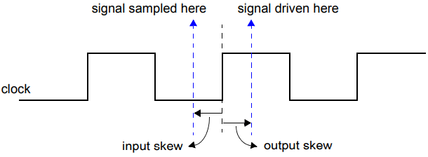
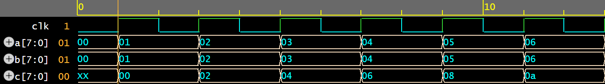
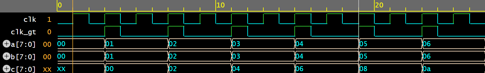

# Clocking Block
clocking block是与某个时钟相关联的一组同步信号的集合。每个clocking block都和一个时钟关联起来，clocking block内的信号可以看作是一组独立的变量（clockvar），但是使用时总是和外部信号关联起来（如果不显式关联，默认和外部同名信号关联）。

```sv
module test;
  logic       clk;
  logic [7:0] a;
  logic [7:0] b;

  clocking cb @(posedge clk);
    input a;           // 隐式关联到 logic [7:0] a
    input a1 = a;      // 显式关联到 logic [7:0] a
    input a2 = {b, a}; // 显式关联到多个信号
  endclocking
endmodule
```

## 端口
input表示将外部关联信号采样到对应的clockvar，只能读；output表示将clockvar驱动到对应的关联信号上，只能写；inout表示有两个同名的clockvar，一个用于采样，一个用于驱动。

## skew
input skew用于控制采样提前量（参见[input采样](#input)），默认的input skew是`#1step`；output skew用于控制驱动的延迟量，默认的output skew是`#0`（参见[output驱动](#output)）。



支持灵活调整input和output skew:
```sv
clocking bus @(posedge clock1);
  default input #10ns output #2ns;             // 修改默认的input/output skew
  input data, ready, enable = top.mem1.enable; // 使用上述默认的input skew (10ns)
  output negedge ack;                          // 使用上述默认的output skew (2ns)
  input #1step addr;                           // 指定addr的input skew为 #1step
endclocking
```

## clock event

关联时钟信号翻转到对应的敏感沿时，在随后的observed event region会触发该cb块的clock event。

## input采样
input采样分为以下两个步骤：

- 采样：采样关联信号。对于非`#0`的input skew，在当前time slot之前input skew的postponed event region中采样；对于显式`#0`的input skew，在当前time slot的observed event region中采样。
- 驱动：在clock event触发之前将上述采样值驱动到对应的clockvar。

!!! note
    - 环境中所有使用clock blocking的input变量的表达式，使用的都是对应的clockvar的值。
    - 在一个time slot的迭代过程中，observed event region可能被执行多次（例如，在re-active region触发active region的 event），除非关联时钟被重新触发，否则后续迭代过程中不再重复采样。

!!! quote "IEEE Std 1800™-2023: Standard for SystemVerilog, 14.13"
    ```sv
    clocking cb @(negedge clk);
      input v;
    endclocking
    always @(cb) $display(cb.v);
    always @(negedge clk) $display(cb.v);
    ```
    The preceding first always procedure is guaranteed to display the updated sampled value of signal `v`. In contrast, the second always exhibits a potential race and may display the old or the newly updated sampled value.

## output驱动
为了模拟output skew的延迟效果，整个output驱动过程包含以下两个步骤：

- 采样：采样等号右边表达式的值。和non-blocking assignment类似，等号右边在active（或re-active，对应program程序块）event region执行。
- 驱动：将上述采样值驱动到关联信号上。对于`#0`的output skew，发生在最近clock event所在time slot的Re-NBA event region；对于非`#0`的output skew，发生在最近clock event之后output skew的time slot的Re-NBA event region。

!!! note
    output驱动通常都是由clock event触发的，因此，采样驱动值的active event region和原始时钟触发的active event region有固定的先后顺序（参见[Scheduling Semantics](schedule.md)），不存在竞争冒险。而且也可以安全的使用input端口的clockvar作为采样来源（input clockvar总是在clock event触发前更新）。

## clocking block的作用
clocking block是不可综合的，是验证专用特性。其主要作用是隔离RTL和验证环境的event region，避免竞争冒险。由于clock event是在observed event region触发，因此天然隔离了RTL中时序逻辑active-inactive-NBA的循环迭代。采用clocking block，环境执行驱动、采样逻辑时，RTL时序逻辑的迭代已经稳定，从而避免竞争冒险。

### 简单时序逻辑
```sv linenums="1" hl_lines="40 41"
module dut(
  input clk,
  output reg [7:0] a,
  input [7:0] b
  );

  reg [7:0] c;

  always @(posedge clk) a <= a + 1'b1;
  always @(posedge clk) c <= a + b;

  initial a = 0;
endmodule

interface intf(input clk);
  logic [7:0] a;
  logic [7:0] b;

  clocking cb @(posedge clk);
    input a;
    output b;
  endclocking

  initial b = 0;
endinterface

module tb;
  logic clk;
  intf m_if(clk);
  dut u_dut(clk, m_if.a, m_if.b);

  always #1 clk = ~clk;

  initial clk = 0;

  initial begin
    fork
      begin
        while (1) begin
          @(m_if.cb);
          m_if.cb.b <= m_if.cb.a + 1;
        end
      end
      begin
        #100;
        $finish;
      end
    join
  end
endmodule
```

dut波形如下：



第40行在`clk`信号对应clock event被唤醒（observed event region），第41行`m_if.cb.a`的采样值是关联信号`a`在`1step`之前的postponed event region的值（即，跳变前的值），对`b`的驱动发生在Re-NBA event region。

**实际上，对于这种简单的时序逻辑，不使用clocking block也能达到同样的效果**。将第40和41行换成：
```sv
          @(posedge clk);
          m_if.b <= m_if.a + 1;
```
所有驱动都使用非阻塞赋值，对于同一个触发源`@(posedge clk)`，采样发生在active event region，驱动发生在NBA event region，这两个event region同样具有明确的顺序，不存在竞争冒险。

### 复杂时序逻辑
在dut中引入icg时钟分频，信号`b`的驱动按照`1/2`速率驱动。

```sv linenums="1" hl_lines="61 62"
module icg_div2(
  input clk_i,
  output clk_o
  );
  reg en;
  reg gt; // latch of en
  always @(posedge clk_i) en <= en + 1'b1;
  always @(clk_i or en) begin
    if (~clk_i) gt <= en;
  end
  assign clk_o = gt & clk_i;

  initial begin
    en = 0;
    gt = 0;
  end
endmodule

module dut(
  input clk,
  output reg [7:0] a,
  input [7:0] b
  );

  wire clk_gt;
  reg [7:0] c;

  icg_div2 u_icg(clk, clk_gt);

  always @(posedge clk_gt) a <= a + 1'b1;
  always @(posedge clk_gt) c <= a + b;

  initial a = 0;
endmodule

interface intf(input clk);
  logic [7:0] a;
  logic [7:0] b;

  clocking cb @(posedge clk);
    input a;
    output b;
  endclocking

  initial b = 0;
endinterface

module tb;
  logic       clk;
  intf m_if(clk);
  dut u_dut(clk, m_if.a, m_if.b);

  always #1 clk = ~clk;

  initial clk = 0;

  initial begin
    fork
      begin
        while (1) begin
          repeat (2) @(m_if.cb);
          m_if.cb.b <= m_if.cb.a + 1;
        end
      end
      begin
        #100;
        $finish;
      end
    join
  end
endmodule
```

dut波形如下：



